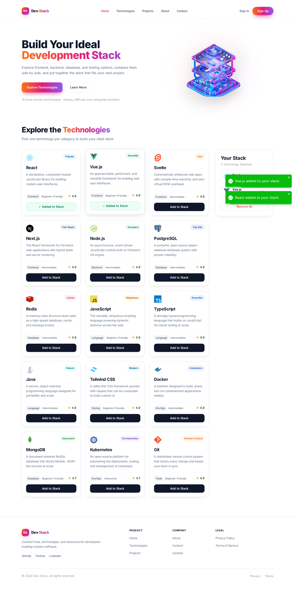

# 🧱 A-5 Dev Stack Builder Website

  
  
  
  
  

##  Description

**Dev Stack** is a single-page React app that helps developers plan a project's technology stack
without opening twenty browser tabs. You browse a curated catalogue of frontend, backend, database,
language, styling and DevOps technologies — each with a rating, a difficulty level and a short
description — and add the ones you like to a live **"Your Stack"** panel next to the grid.
That panel becomes a short, shareable summary of the tools your next project will run on.

Everything is client side: the technology list lives in a JSON file, the only state is your own
selection, and a small toast in the corner confirms every action you take.

>  The whole interface is themed from **one** gradient (orange → pink → violet) defined in
> `src/theme/brand.js`. Change those three colours and the logo, the hero heading, the buttons,
> the focus rings and the shadows all re-theme together.

---

##  Technologies Used

 **React 19** ==> Component-based UI, hooks for state and data loading
 **Vite 8** ==> Blazing-fast dev server and production build
 **Tailwind CSS 3** ==> Utility-first styling, responsive from mobile to desktop
 **JavaScript (ES6+)** ==> Plain JS — no TypeScript — with arrow functions, async/await and modules 
 **React-Toastify 11** ==> Toast alerts for add, duplicate, remove and remove-all actions 
 **JSON** ==> `public/data/technologies.json` holds the 15-technology catalogue
 **Context API + Hooks** ==> `useState`, `useEffect`, `useContext`, `useMemo`, `useCallback`
 **Inter (variable font)** ==> Self-hosted via `@fontsource-variable/inter`, no external font request

---

##  3 Key Features

1. ** Technology catalogue loaded from JSON** — 15 technologies are fetched from a JSON file with a
   real loading spinner, an error fallback, and a 3 / 2 / 1-column responsive grid. Every card shows
   its icon, badge, category chip, difficulty and star rating.
2. ** Live "Your Stack" builder** — add any technology to a sidebar panel that counts your picks
   ("2 Technology Selected"), lists each one with a ✕ remove button, supports "Remove All", blocks
   duplicates with a warning toast, and switches between an empty state and a filled state.
3. ** One-gradient brand theme + polished UX** — a single shared orange → pink → violet gradient
   drives the brand name, the hero highlight and the primary buttons; add to that a sticky navbar
   with a mobile hamburger menu, toast feedback for every action, smooth scrolling, and a fully
   responsive layout down to 320 px.

---

##  React Questions & Answers

### 1. What is JSX, and why is it used in React?

JSX is the HTML-like syntax we write inside JavaScript files — for example
`<h3 className="text-xl">{tech.name}</h3>`. A build tool (Vite, in this project) turns it into plain
JavaScript function calls before the browser sees it. React uses JSX because it keeps markup and the
logic that produces it in the same place, so a component reads almost exactly like the UI it renders.
Because JSX is still JavaScript, I can drop expressions into it with `{}` — that is how the cards print
`{tech.name}`, `{tech.rating}` and `{tech.description}`.

### 2. What is the difference between props and state?

Props are data that a component receives **from its parent**; they are read-only, so the child can only
display them or pass them further down. State is data a component owns and can change itself, and when
it changes React re-renders that component. In this project `TechCard` receives `tech`, `isInStack` and
`onAdd` as props, while the selected technologies live in state inside `StackProvider`. A simple way to
remember it: props flow in, state lives in.

### 3. What does the `useState` hook do, and where did you use it in this project?

`useState` gives a function component its own piece of memory. It returns the current value and a
setter function, and calling the setter updates the value and re-renders the component. I used it in
several places:

- `StackProvider` → `const [stack, setStack] = useState([])` holds the user's selected technologies.
- `useTechnologies` → `useState([])`, `useState(true)` and `useState(null)` hold the fetched data, the
  loading flag and the error message.
- `Navbar` → `useState(false)` opens and closes the mobile menu, and another state tracks the active
  nav link while scrolling.
- `Hero` → `useState(false)` controls the "Learn More" dialog.

### 4. What does the `useEffect` hook do, and why did you need it to load the JSON data?

`useEffect` runs side effects — work that is not just rendering, like fetching data, timers or event
listeners — after the component renders. It takes a dependency array that decides when it re-runs; an
empty array `[]` means "run once, after the first render". I needed it to load the JSON because
`fetch()` is asynchronous and must not run during rendering: rendering has to stay pure and fast, while
the request happens afterwards and updates state when it resolves. My `useTechnologies` hook fetches the
file inside `useEffect`, then sets the data, clears the loading flag and stores an error message if
something goes wrong — and the cleanup function aborts the request if the component unmounts.

### 5. Why does every item in a `.map()` list need a unique `key` prop?

Because React needs a stable identity for each rendered item so it can tell which items were added,
removed or reordered between renders. Without a key React falls back to the position in the array,
which causes wrong or stale DOM updates — for example the wrong card keeping an "✓ Added to Stack"
label after a list change. Keys are not passed to the component as props; they are used only by React
itself. In this project each card is rendered as
`<TechCard key={tech.id} … />` and each stack item as `<StackItem key={tech.id} … />`, using the unique
`id` from the JSON (never the array index).

### 6. What is conditional rendering? Show one place you used it.

Conditional rendering means showing different UI depending on the current state or data, usually with
`&&`, a ternary operator or an early `return`. One example is the "Your Stack" panel in
`StackPanel.jsx`: when `count === 0` it renders a dashed box with the message *"Your stack is empty."*,
otherwise it renders the list of selected technologies plus the "Remove All" button. The same pattern
shows the loading spinner while `loading` is true, and the technology grid only once the data has
arrived. The "Add to Stack" / "✓ Added to Stack" button label is another small conditional render.

### 7. How do you pass data from a parent component to a child component, and how does a child send something back to the parent?

Data goes **down** through props: `TechnologiesSection` passes `technologies`, `isInStack` and `onAdd`
into `<TechGrid />`, which passes them on to each `<TechCard />`. A child sends something **up** by
calling a function that the parent gave it as a prop — it never modifies the parent's state directly.
Here `TechCard` calls `onAdd(tech)` when its button is clicked; that function is `addToStack` from
`StackProvider`, which updates the stack state, and React re-renders both the cards and the sidebar with
the new selection. For the ✕ button it is the same pattern with `onRemove(tech)`.

---

